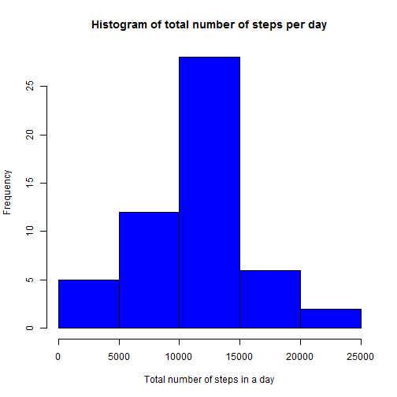
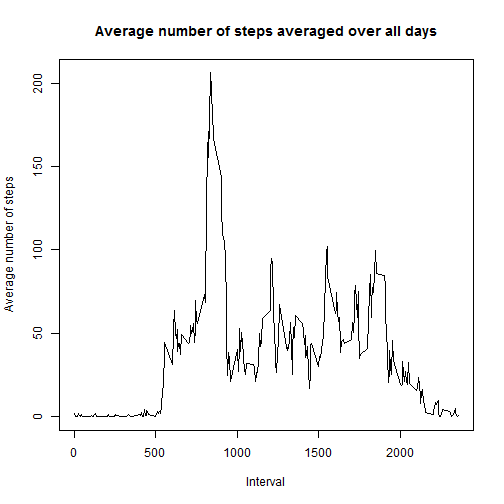
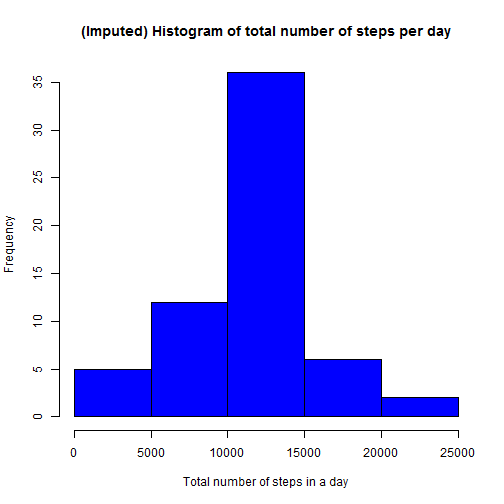
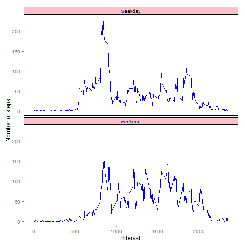

# Reproducible Research: Peer Assessment 1


## Loading and preprocessing the data

1.Load the data (i.e. `read.csv()`)
2.Process/transform the data (if necessary) into a format suitable for your analysis


```r
file<-unzip("activity.zip")
data<-read.csv(file,header = T)
```


## What is mean total number of steps taken per day?

1.Calculate the total number of steps taken per day
2.Make a histogram of the total number of steps taken each day


```r
sum_step<-aggregate(steps ~ date, data, sum,na.rm=T)
hist(sum_step$steps,col=4,main="Histogram of total number of steps per day", xlab="Total number of steps in a day")
```

 

3.Calculate and report the **mean** and **median** total number of steps taken per day

```r
showmean<-mean(sum_step$steps)
showmedian<-median(sum_step$steps)
```
The **mean** of the total number of steps taken per day is 1.0766189 &times; 10<sup>4</sup> steps.
The **median** of the total number of steps taken per day is 10765 steps.

## What is the average daily activity pattern?

1.Make a time series plot (i.e. `type = "l"`) of the 5-minute interval (x-axis) and the average number of steps taken, averaged across all days (y-axis)

```r
avg_step<-aggregate(steps ~ interval, data, mean,na.rm=T)
plot(avg_step$interval, avg_step$steps, type='l', col=1, 
     main="Average number of steps averaged over all days", xlab="Interval", 
     ylab="Average number of steps")
```

 

2.Which 5-minute interval, on average across all the days in the dataset, contains the maximum number of steps?

```r
maxs<-max(avg_step$steps)
int<-avg_step[avg_step$steps==maxs,]$interval
```
The interval 835 has the maximum average number of steps.

## Imputing missing values

Note that there are a number of days/intervals where there are missing values (coded as `NA`). The presence of missing days may introduce bias into some calculations or summaries of the data.

1.Calculate and report the total number of missing values in the dataset (i.e. the total number of rows with `NA`s)


```r
df_na <- data[!complete.cases(data),]
nb<-nrow(df_na)
```

There are 2304 rows contain the `NA` value.

2.Devise a strategy for filling in all of the missing values in the dataset. The strategy does not need to be sophisticated. For example, you could use the mean/median for that day, or the mean for that 5-minute interval, etc.
3. Create a new dataset that is equal to the original dataset but with the missing data filled in.


```r
for(i in 1:nrow(data)){
        if(is.na(data$steps[i])){
                data$steps[i]<-avg_step[avg_step$interval==data$interval[i],]$steps
        }
}
```

4. Make a histogram of the total number of steps taken each day and Calculate and report the **mean** and **median** total number of steps taken per day. Do these values differ from the estimates from the first part of the assignment? What is the impact of imputing missing data on the estimates of the total daily number of steps?


```r
imputed_step <- aggregate(steps ~ date, data, sum)
hist(imputed_step$steps, col=4, main="(Imputed) Histogram of total number of steps per day", xlab="Total number of steps in a day")
```

 

```r
showmean2<-mean(sum_step$steps)
showmedian2<-median(sum_step$steps)
```
The **mean** of the total number of steps taken per day(NA replaced) is 1.0766189 &times; 10<sup>4</sup> steps.  
The **median** of the total number of steps taken per day(NA replaced) is 10765 steps. 
The values remain the same as the value of the first part.

## Are there differences in activity patterns between weekdays and weekends?

For this part the `weekdays()` function may be of some help here. Use
the dataset with the filled-in missing values for this part.

1.Create a new factor variable in the dataset with two levels -- "weekday" and "weekend" indicating whether a given date is a weekday or weekend day.


```r
Sys.setlocale("LC_TIME", "American")
```

```
## [1] "English_United States.1252"
```

```r
data$date<-as.Date(data$date)
data$day<-ifelse((weekdays(data$date)=="Saturday" | weekdays(data$date)== "Sunday"),
                 "weekend","weekday")
```

2.Make a panel plot containing a time series plot (i.e. `type = "l"`) of the 5-minute interval (x-axis) and the average number of steps taken, averaged across all weekday days or weekend days (y-axis).


```r
library(ggplot2)
avg<-aggregate(steps~interval+day,data,mean)
ggplot(avg, aes(x=interval,y=steps)) + geom_line(binwidth=2,col=4)+facet_wrap(~ day,ncol=1)+
        xlab("Interval")+ylab("Nomber of steps")+
        theme(panel.background = element_rect(fill="white",colour="black"),panel.grid.minor = element_blank())+
        theme(strip.background = element_rect(fill="pink",colour="black"))
```

 
